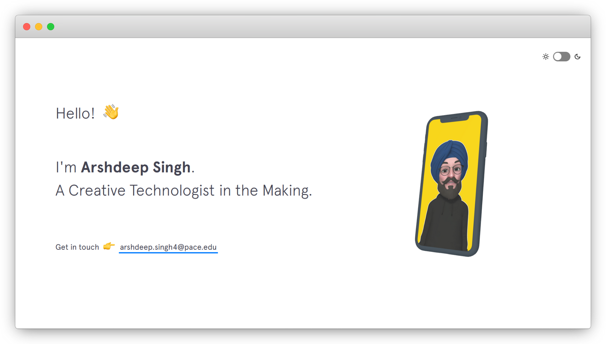

# Portfolio Website 

<h3> Singh's portfolio website built with Jekyll </h3>



> Inspired by [brittanychiang.com](https://brittanychiang.com) ✊

<br>

## Getting Started

1. You will need [Ruby](https://www.ruby-lang.org/en/) and [Bundler](https://bundler.io/) to use [Jekyll](https://jekyllrb.com/).

2. Installed dependencies in the `Gemfile`:

```sh
$ bundle install 
```

3. Serve the website (`localhost:4000` by default):

```sh
$ bundle exec jekyll serve --livereload
```


